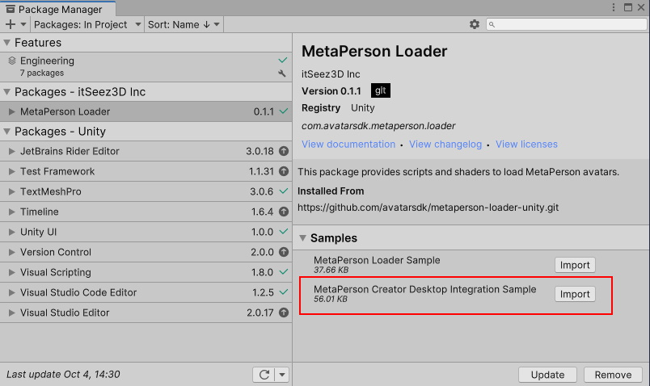
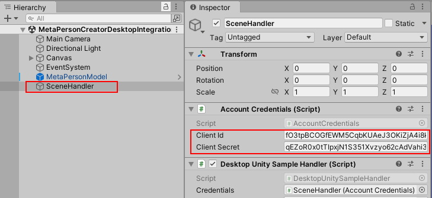
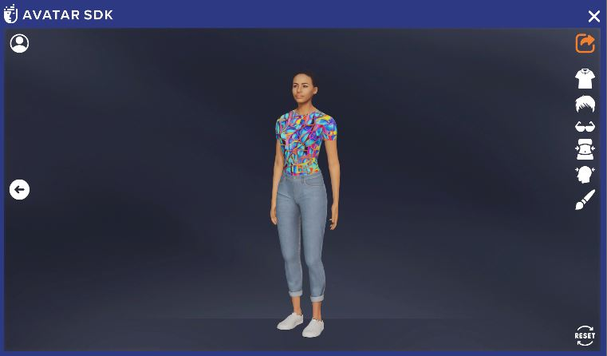
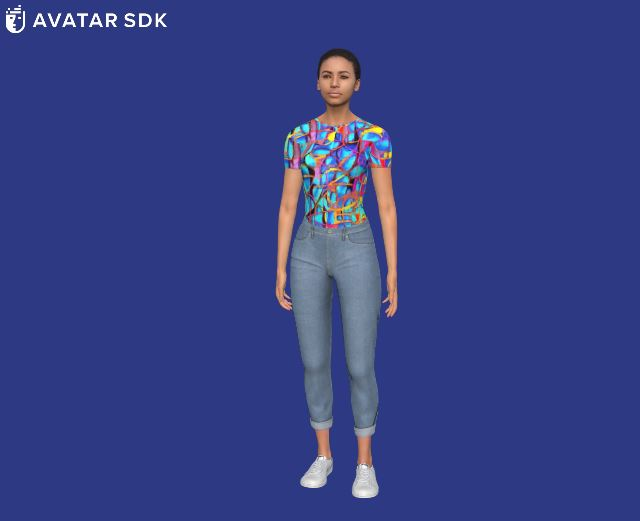
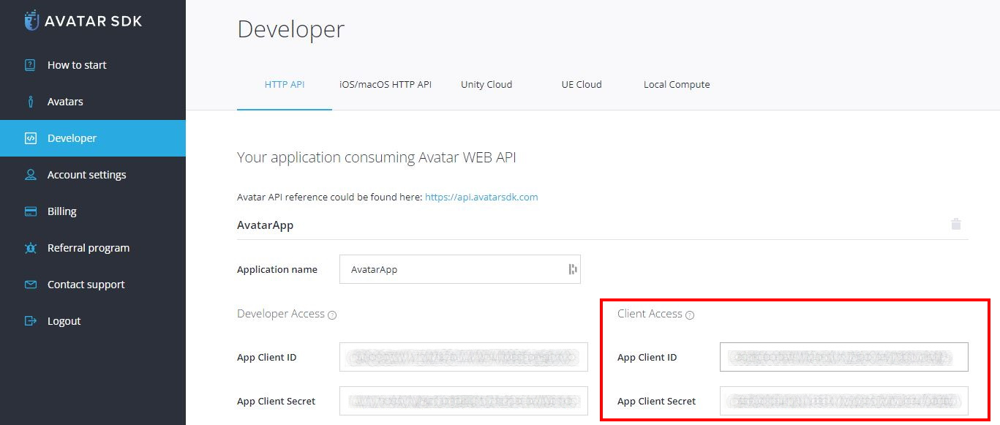

# MetaPerson Creator - Integration Into Windows And MacOS Unity Application 
This sample demonstrates how to integrate the [MetaPerson Creator](https://metaperson.avatarsdk.com/) web page into **Windows** or **macOS** applications and export an avatar from it.

**Note:** A special WebView component is required to display web pages inside a Unity application. This sample uses the [Vuplex Web View](https://store.vuplex.com/webview/windows-mac) plugin. We can provide you with a **20% discount** coupon for this plugin. Please contact us <support@avatarsdk.com> to get it.

Watch also the [video tutorial on Youtube](https://www.youtube.com/watch?v=UT143JebgoE_channel=AvatarSDK).

## Requirements
 * [Vuplex Web View](https://store.vuplex.com/webview/windows-mac) plugin
 * Unity 2021.3.19f1 or a more recent version
 * Built-in render pipeline
 * Linear color space for better rendering quality

## Getting Started
**1\.** Open the sample scene. 

You can get this sample via Unity Package Manager or clone the repository and run the sample from it.

### Get the sample via Package Manager.

 * Open *Window->Package Manager*, click on the **+** icon in the top left corner and select **Add Package From Git URL**.
 


 * Provide the Git URL of this project:

`https://github.com/avatarsdk/metaperson-loader-unity.git`

 * Import **MetaPerson Creator Desktop Integration Sample** as well.



 * Open the `Assets/Samples/MetaPerson Loader/0.1.1/MetaPerson Creator Desktop Integration Sample/Scenes/MetaPersonCreatorDesktopIntegrationSample.unity` scene.

### Get the sample from the repository.

 * Clone this repository to your computer.

 * Open the project from `metaperson-loader-unity\Samples~\MetaPersonCreatorDesktopIntegrationSample` directory in Unity 2021.3.19f1 or a newer.

 * Open the `Assets/AvatarSDK/MetaPerson/DesktopIntegrationSample/Scenes/MetaPersonCreatorDesktopIntegrationSample.unity` scene.
 
**2\.** Import [Vuplex plugin](https://store.vuplex.com/webview/windows-mac) into the project.

**3\.** Find **SceneHandler** object and provide your [Account Credentials](#account-credentials).



**4\.** Run the scene.

**5\.** Press the **Get Avatar** button. MetaPerson Creator page will be shown.

**6\.** Select any of the sample avatars or create your own, customize it, and press the **Export** button.



**7\.** The avatar will be exported and added to the scene.



## Account Credentials
To export models from the [MetaPerson Creator](https://metaperson.avatarsdk.com/), you'll need AvatarSDK developer account credentials. Follow these steps to obtain them:

1. **Create an AvatarSDK Developer Account.**
   Visit the [AvatarSDK Developer Signup page](https://accounts.avatarsdk.com/developer/signup/) to create your AvatarSDK developer account. If you already have an account, you can skip this step.

2. **Create an Application.**
   After successfully registering or logging in to your AvatarSDK developer account, go to the [Developer Dashboard](https://accounts.avatarsdk.com/developer/). Here, create a new application. 

3. **Retrieve Your App Client ID and App Client Secret.**
   Once your application is created, you can obtain your **App Client ID** and **App Client Secret** from the Developer Dashboard.




Find out more information about business integration at https://docs.metaperson.avatarsdk.com/business_integration.html. 

## How It Works
A WebView component is required to show the [MetaPerson Creator](https://metaperson.avatarsdk.com/iframe.html) page in Unity application. This sample uses the [Vuplex Web View](https://store.vuplex.com/webview/windows-mac) for this purpose.

The [MetaPerson Creator](https://metaperson.avatarsdk.com/iframe.html) page communicates with the Unity application via [JS API](https://docs.metaperson.avatarsdk.com/js_api.html).

Here's how it works:

1. Load the following page in a WebView component: `https://metaperson.avatarsdk.com/iframe.html`.

2. Prior to loading the page, execute the following JavaScript code. This code subscribes to events from the [MetaPerson Creator](https://metaperson.avatarsdk.com/iframe.html) page and posts messages with authentication, export, and UI parameters:

```javascript
const CLIENT_ID = "your_client_id";
const CLIENT_SECRET = "your_client_secret";

function onWindowMessage(evt) {
	if (evt.type === 'message') {
		if (evt.data?.source === 'metaperson_creator') {
			let data = evt.data;
			let evtName = data?.eventName;
			if (evtName === 'unity_loaded') {
				onUnityLoaded(evt, data);
			} else if (evtName === 'model_exported') {
				console.log('model url: ' + data.url);
				console.log('gender: ' + data.gender);
				window.vuplex.postMessage(evt.data);
			}
		}
	}
}

function onUnityLoaded(evt, data) {
	let authenticationMessage = {
		'eventName': 'authenticate',
		'clientId': CLIENT_ID,
		'clientSecret': CLIENT_SECRET
	};
	window.postMessage(authenticationMessage, '*');

	let exportParametersMessage = {
		'eventName': 'set_export_parameters',
		'format': 'glb',
		'lod': 1,
		'textureProfile': '1K.jpg'
	};
	evt.source.postMessage(exportParametersMessage, '*');
	
	let uiParametersMessage = {
		'eventName': 'set_ui_parameters',
		'isExportButtonVisible' : true,
		'closeExportDialogWhenExportComlpeted' : true,
	};
	evt.source.postMessage(uiParametersMessage, '*');
}

window.addEventListener('message', onWindowMessage);
```

* The **onUnityLoaded** method sets your client credentials and [export parameters](#js-api-parameters).
* The **onWindowMessage** method handles messages received from the [MetaPerson Creator](https://metaperson.avatarsdk.com/iframe.html) page.
* When an avatar model is exported, the corresponding **model_exported** event is received, including the URL of the model and its gender.
* Upon receiving the **model_exported** event, the model is loaded into the scene using its URL.

Implementation details can be found in the [MPCWebPageUsageSample.cs script](./../Samples~/MetaPersonCreatorDesktopIntegrationSample/Assets/AvatarSDK/MetaPerson/DesktopIntegrationSample/Scripts/DesktopUnitySampleHandler.cs).

## JS API Parameters
The JS API allows you to configure various parameters related to authentication, export, and the user interface (UI) of the [MetaPerson Creator](https://metaperson.avatarsdk.com/iframe.html).

### Authentication Parameters
To ensure your application is authorized to access the [MetaPerson Creator](https://metaperson.avatarsdk.com/iframe.html), you need to specify your [developer credentials](#account-credentials). The following parameters are involved:
 - **eventName:** This should be set to `authenticate`. This parameter informs the [MetaPerson Creator](https://metaperson.avatarsdk.com/iframe.html) of the type of request you are making.
 - **clientId:** This should be your **App Client ID** from your account.
 - **clientSecret:** This should be your **App Client Secret** from your account.

### Export Parameters
You can customize the output of the exported avatar by specifying parameters related to file format, resolution, and other options. These parameters include:
 - **eventName:** This should be set to `set_export_parameters` to inform the [MetaPerson Creator](https://metaperson.avatarsdk.com/iframe.html) of the type of request you are making.
 - **format:** Specifies the mesh format of the exported avatar. Supported formats include **gltf**, **glb**, and **fbx**.
 - **lod:** Determines the level of detail (LOD) for the exported avatar mesh. The higher the value, the less detailed the mesh. Possible values are **1** and **2**.
 - **textureProfile:** Specifies the texture profile for the exported avatar, defining textures' resolution and format. Available options include **4K.png**, **2K.png**, **1K.png**, **4K.jpg**, **2K.jpg**, **1K.jpg**, **4K.webp**, **2K.webp**, and **1K.webp**.

### UI Parameters
You can also customize certain aspects of the [MetaPerson Creator](https://metaperson.avatarsdk.com/iframe.html) user interface. These parameters include:
 - **eventName:** This should be set to `set_ui_parameters`. This parameter informs the [MetaPerson Creator](https://metaperson.avatarsdk.com/iframe.html) of the type of request you are making.
 - **isExportButtonVisible:** This parameter specifies whether the **export** button is visible in the UI.
 - **closeExportDialogWhenExportCompleted:** This parameter determines whether the modal window with the export link is closed automatically after the export is completed.

More information about JS API can be found here: https://docs.metaperson.avatarsdk.com/js_api.html

## Support
If you have any questions or issues with the plugin, please contact us <support@avatarsdk.com>.
