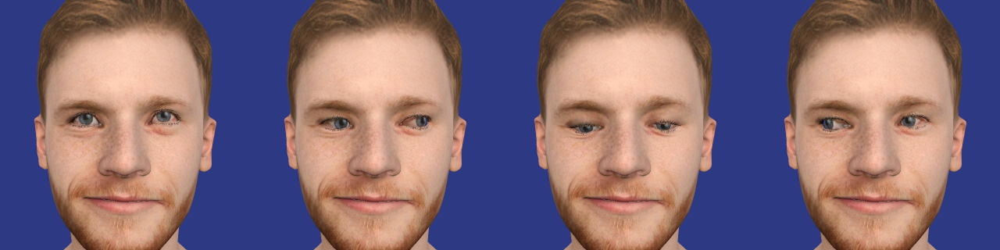

# MetaPerson Creator - Eyes Animation Sample

This sample demonstrates how to animate eye movements (look up, down, left, right)

## Getting Started
**1\.** Open the sample scene. 

You can get this sample via Unity Package Manager or clone the repository and run the sample from it.

### Get the sample via Package Manager.

 * Open *Window->Package Manager*, click on the **+** icon in the top left corner and select **Add Package From Git URL**.
 

 * Provide the Git URL of this project:

`https://github.com/avatarsdk/metaperson-loader-unity.git`

 * Import **MetaPerson Creator Desktop Integration Sample** as well.

 * Open the `Assets/Samples/MetaPerson Loader/<ver>/MetaPerson Eyes Animation Sample/Scenes/EyesAnimationSample.unity` scene.

### Get the sample from the repository.

 * Clone this repository to your computer.

 * Open the project from the `metaperson-loader-unity\Samples~\MetaPersonLoaderEyesAnimationSample` directory in Unity 2021.3.19f1 or a newer.

 * Open the `Assets/AvatarSDK/MetaPerson/EyesAnimationSample/Scenes/EyesAnimationSample.unity` scene.

**2\.** Run the scene.

**3\.** Press any button in the top right corner to simulate corresponding movement.  

## How It Works

The `EyesAnimator` component should be added to the avatar object. This component provides methods for setting a weight (a float value in the range [0, 1]) for corresponding eye movements:
`SetLookUpWeight`, `SetLookDownWeight`, `SetLookLeftWeight` and `SetLookRightWeight`.

Each of these methods sets blendshapes values for the **AvatarHead** and **AvatarEyelashes** skinned mesh renderers, and rotates **LeftEye** and **RightEye** transforms to an angle interpolated depending on the weight along the specified axis.

### Look Up Extreme Position

1. **AvatarHead** and **AvatarEyelashes** blendshapes:
  * `eyeLookUpLeft` = MAX_BLEND_VALUE
  * `eyeLookUpRight` = MAX_BLEND_VALUE
  * `eyeLookDownLeft` = 0
  * `eyeLookDownRight` = 0
  
2. Rotate **LeftEye** and **RightEye** along the local X axis by -23 degrees.

### Look Down Extreme Position

1\. **AvatarHead** and **AvatarEyelashes** blendshapes:
  * `eyeLookUpLeft` = 0
  * `eyeLookUpRight` = 0
  * `eyeLookDownLeft` = MAX_BLEND_VALUE
  * `eyeLookDownRight` = MAX_BLEND_VALUE
  
2\. Rotate **LeftEye** and **RightEye** along the local X axis by 23 degrees.

### Look Left Extreme Position

1\. **AvatarHead** and **AvatarEyelashes** blendshapes:
  * `eyeLookOutLeft` = MAX_BLEND_VALUE
  * `eyeLookOutRight` = 0
  * `eyeLookInLeft` = 0
  * `eyeLookInRight` = MAX_BLEND_VALUE
  
2\. Rotate **LeftEye** along the local Y axis by -45 degrees.

3\. Rotate **RightEye** along the local Y axis by -25 degrees.

### Look Right Extreme Position

1\. **AvatarHead** and **AvatarEyelashes** blendshapes:
  * eyeLookOutLeft = 0
  * eyeLookOutRight = MAX_VALUE
  * eyeLookInLeft = MAX_VALUE
  * eyeLookInRight = 0
  
2\. Rotate **LeftEye** along the local Y axis by 25 degress.

3\. Rotate **RightEye** along the local Y axis by 45 degress.
 

## Support
If you have any questions or issues with the plugin, please contact us <support@avatarsdk.com>.
