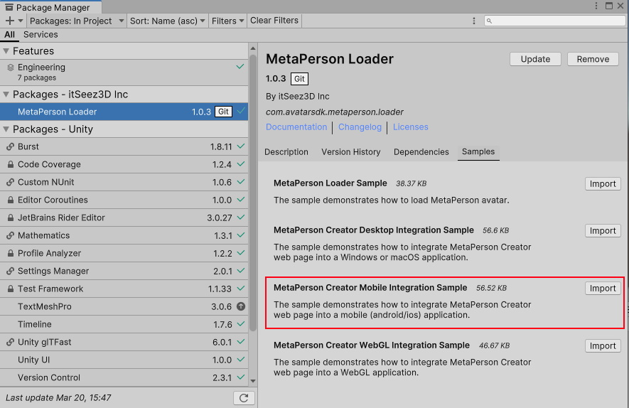
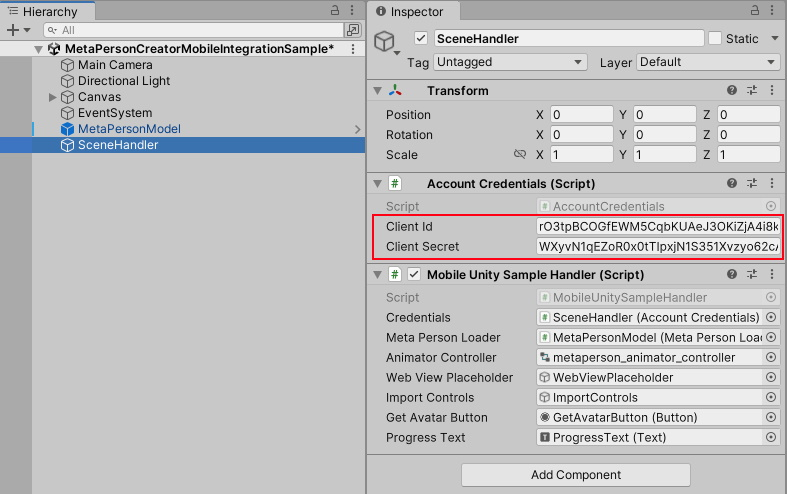
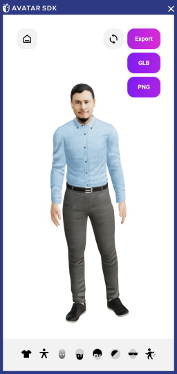

# MetaPerson Creator - Integration Into Android And iOS Unity Application 
This sample demonstrates how to integrate the [MetaPerson Creator](https://mobile.metaperson.avatarsdk.com/generator) web page into **Android** or **iOS** applications and export an avatar from it.

**Note:** A special WebView component is required to display web pages inside a Unity application. This sample uses the Vuplex Web View plugin for [Android](https://store.vuplex.com/webview/android) and [iOS](https://store.vuplex.com/webview/ios). We can provide you with a **20% discount** coupon for this plugin. Please contact us <support@avatarsdk.com> to get it.

## Requirements
 * Vuplex Web View plugin for [Android](https://store.vuplex.com/webview/android) and [iOS](https://store.vuplex.com/webview/ios)
 * Unity 2021.3.19f1 or a more recent version
 * Built-in render pipeline
 * Linear color space for better rendering quality

## Getting Started
**1\.** Open the sample scene. 

You can get this sample via Unity Package Manager or clone the repository and run the sample from it.

### Get the sample via Package Manager.

 * Open *Window->Package Manager*, click on the **+** icon in the top left corner and select **Add Package From Git URL**.
 


 * Provide the Git URL of this project:

`https://github.com/avatarsdk/metaperson-loader-unity.git`

 * Import **MetaPerson Creator Mobile Integration Sample** as well.



 * Open the `Assets/Samples/MetaPerson Loader/1.0.3/MetaPerson Creator Mobile Integration Sample/Scenes/MetaPersonCreatorMobileIntegrationSample.unity` scene.

### Get the sample from the repository.

 * Clone this repository to your computer.

 * Open the project from `metaperson-loader-unity\Samples~\MetaPersonCreatorMobileIntegrationSample` directory in Unity 2021.3.19f1 or a newer.

 * Open the `Assets/AvatarSDK/MetaPerson/MobileIntegrationSample/Scenes/MetaPersonCreatorMobileIntegrationSample.unity` scene.
 
**2\.** Import Vuplex plugin for [Android](https://store.vuplex.com/webview/android) or [iOS](https://store.vuplex.com/webview/ios) into the project.

**3\.** Find **SceneHandler** object and provide your [Account Credentials]((./Documentation~/AccountCredentials.md)).



**4\.** Build and run application.

**5\.** Press the **Get Avatar** button. MetaPerson Creator page will be shown.

**6\.** Select any of the sample avatars or create your own, customize it, and press the **Export** -> **GLB** button.



**7\.** The avatar will be exported and added to the scene.


## How It Works
A WebView component is required to show the [MetaPerson Creator](https://mobile.metaperson.avatarsdk.com/generator) page in Unity application. This sample uses the Vuplex Web View plugin for [Android](https://store.vuplex.com/webview/android) and [iOS](https://store.vuplex.com/webview/ios).

The [MetaPerson Creator](https://metaperson.avatarsdk.com/iframe.html) page communicates with the Unity application via [JS API](https://docs.metaperson.avatarsdk.com/js_api.html).

Here's how it works:

1. Load the following page in a WebView component: `https://mobile.metaperson.avatarsdk.com/generator`.

2. Once the page is loaded, the following JavaScript code is executed. It checks if the `window.metaPersonCreator.isLoaded` or waits for a special `mobile_loaded` event that indicates that the MetaPerson Creator page is ready for message communication. 
After that the app posts messages with authentication, export, and UI parameters.

```javascript
function sendConfigurationParams() {
  console.log('sendConfigurationParams');

  const CLIENT_ID = '" + credentials.clientId + @"';
  const CLIENT_SECRET = '" + credentials.clientSecret + @"';

  let authenticationMessage = {
    'eventName': 'authenticate',
    'clientId': CLIENT_ID,
    'clientSecret': CLIENT_SECRET
  };
  window.postMessage(authenticationMessage, '*');

  let exportParametersMessage = {
    'eventName': 'set_export_parameters',
    'format': 'glb',
    'lod': 2,
    'textureProfile': '1K.jpg'
  };
  window.postMessage(exportParametersMessage, '*');

  let uiParametersMessage = {
    'eventName': 'set_ui_parameters',
    'isExportButtonVisible' : true,
    'isLoginButtonVisible': true
  };
  window.postMessage(uiParametersMessage, '*');
}

function onWindowMessage(evt) {
  console.log('onWindowMessage: ' + evt.data);
  if (evt.type === 'message') {
    if (evt.data?.source === 'metaperson_creator') {
      let data = evt.data;
      let evtName = data?.eventName;
      if (evtName === 'unity_loaded' ||
        evtName === 'mobile_loaded') {
        sendConfigurationParams();
      } else if (evtName === 'model_exported') {
        console.log('model url: ' + data.url);
        console.log('gender: ' + data.gender);
        console.log('avatar code: ' + data.avatarCode);
        window.vuplex.postMessage(evt.data);
      }
    }
  }
}
window.addEventListener('message', onWindowMessage);

if (window.metaPersonCreator && window.metaPersonCreator.isLoaded)
  sendConfigurationParams();
```
3. When the MetaPerson Creator exports an avatar, it sends the `model_exported` event that contains a URL to a GLB file with the avatar.

Implementation details can be found in the [MobileUnitySampleHandler.cs script](./../Samples~/MetaPersonCreatorMobileIntegrationSample/Assets/AvatarSDK/MetaPerson/MobileIntegrationSample/Scripts/MobileUnitySampleHandler.cs).

More information about JS API parameters can be found here: https://docs.metaperson.avatarsdk.com/js_api.html

## Support
If you have any questions or issues with the sample, please contact us <support@avatarsdk.com>.
