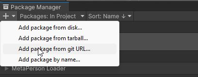
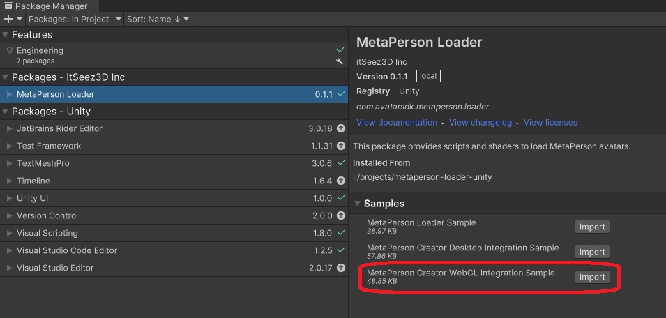
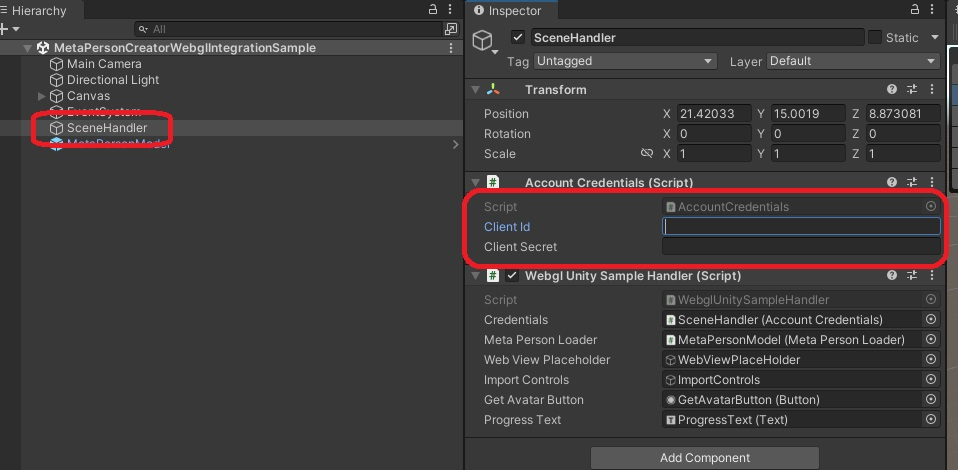
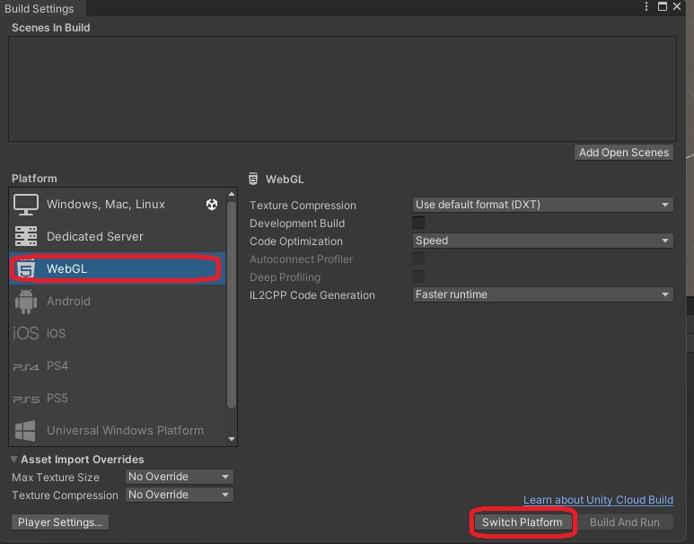

# MetaPerson Creator - Integration Into WebGL Application 
This sample demonstrates how to integrate the [MetaPerson Creator](https://metaperson.avatarsdk.com/) web page into **WebGL** applications via an IFrame embedded into an HTML page.

## Reqirements
 * Unity 2021.3.19f1.
 * Built-in render pipeline
 * Linear color space for better rendering quality
 
**Note:** if you are using 2022 or newer version of the Unity, the MetaPerson Creator page isn't loaded in Unity's built-in dev web server due to a Cross-Origin-Embedder-Policy HTTP response header that disables cross-origin iframes by default.

## Getting Started
**1\.** Open the sample scene. 

You can get this sample via Unity Package Manager or clone the repository and run the sample from it.

### Get the sample via Package Manager.

 * Open *Window->Package Manager*, click on the **+** icon in the top left corner and select **Add Package From Git URL**.
 


 * Provide the Git URL of this project:

`https://github.com/avatarsdk/metaperson-loader-unity.git`

 * Import **MetaPerson Creator WebGL IFrame Integration Sample** as well.



 * Open the `Assets/Samples/MetaPerson Loader/x.y.z/MetaPerson Creator WebGL IFrame Integration Sample/Scenes/MetaPersonCreatorWebGLIFrameIntegrationSample.unity` scene.


### Get the sample from the repository.

 * Clone this repository to your computer.

 * Open the project from `metaperson-loader-unity\Samples~\MetaPersonCreatorWebGLIFrameIntegrationSample` directory in Unity 2021.3.19f1.

 * Open the `Assets\AvatarSDK\MetaPerson\WebGLIFrameIntegrationSample\Scenes\MetaPersonCreatorWebGLIFrameIntegrationSample.unity` scene.
 
 

**2\.** Find **SceneHandler** object and provide your [Account Credentials](#account-credentials).



**3\.** Open the *File->Build Settings* menu and click on the **WebGL**. After that click on the **Switch Platform button**.



**4\.** Add the `Assets\AvatarSDK\MetaPerson\WebGLIFrameIntegrationSample\Scenes\MetaPersonCreatorWebGLIFrameIntegrationSample.unity` scene into Build Settings.

**5\.** Click the **Build and Run** button and specify the destination path for your WebGL build. The application will be opened in a browser once the building process is completed.

**6\.** Press the **Get Avatar** button. MetaPerson Creator page will be shown.

**7\.** Select any of the sample avatars or create your own, customize it, and press the **Export** button in a top-right corner.


**8\.** The avatar will be exported and added to the scene.


## Account Credentials
To export models from the [MetaPerson Creator](https://metaperson.avatarsdk.com/), you'll need AvatarSDK developer account credentials. Follow these steps to obtain them:

1. **Create an AvatarSDK Developer Account.**
   Visit the [AvatarSDK Developer Signup page](https://accounts.avatarsdk.com/developer/signup/) to create your AvatarSDK developer account. If you already have an account, you can skip this step.

2. **Create an Application.**
   After successfully registering or logging in to your AvatarSDK developer account, go to the [Developer Dashboard](https://accounts.avatarsdk.com/developer/). Here, create a new application. 

3. **Retrieve Your App Client ID and App Client Secret.**
   Once your application is created, you can obtain your **App Client ID** and **App Client Secret** from the Developer Dashboard.


Find out more information about business integration at https://docs.metaperson.avatarsdk.com/business_integration.html. 

## How It Works
An IFrame element is embedded into an app's HTML page. The IFrame loads `https://metaperson.avatarsdk.com/iframe.html` page. Commnications between the app and the MetaPerson Creator page are perfromed via messaging mechanism.

1. A [MetaPersonCreatorIFrame.jslib script](./../Samples~/MetaPersonCreatorWebGLIFrameIntegrationSample/Assets/AvatarSDK/MetaPerson/WebGLIFrameIntegrationSample/Plgins/WebGL/MetaPersonCreatorIFrame.jslib) is responsibe for creating IFrame, configing MetaPerson Creator page and sending an expoted avatar into an application.
2. To open the MetaPerson Creator page, a `showMetaPersonCreator` method is called. It takes the AvatarSDK developer account credentials, an object name and a method that should be called when an avatar is exported.
```cs
[DllImport("__Internal")]
private static extern void showMetaPersonCreator(string clientId, string clientSecret, string modelUrlReceiverObjectName, string modelUrlReceiverMethodName);
...
public void OnGetAvatarButtonClick()
{
    showMetaPersonCreator(credentials.clientId, credentials.clientSecret, "SceneHandler", "HandleModelExportData");
}
```
3. This method subscribes to the `messages` events to be ready to receive messages from the MetaPerson Creator page.
```js
window.addEventListener("message", onWindowMessage);
```
4. It creates the IFrame with some additional HTML elements and configures them. The IFrame is shown instead of a unity canvas with the application.
```js
var metaPersonCreatorContainer = document.createElement('div');
metaPersonCreatorContainer.setAttribute('id', 'metaperson-creator-container');
metaPersonCreatorContainer.innerHTML = `
  <label id="authentication_status_label" style="position:absolute; top:-20px; left:2px;">Athentication Status: Not Provided</label>
  <button id="metaperson-creator-close-button" type="button" style="position:absolute; top:-25px; right:2px; width:100px; height:25px">Close</button>
  <iframe id="metaperson-creator-iframe" src="https://metaperson.avatarsdk.com/dev/v1.13.1/v3/iframe.html" allow="fullscreen"></iframe>
`;

var unityContainer = document.getElementById('unity-container');
unityContainer.insertBefore(metaPersonCreatorContainer, unityContainer.firstChild);

var iframe = document.getElementById('metaperson-creator-iframe');
var unityCanvas = document.getElementById('unity-canvas');
iframe.width = unityCanvas.width;
iframe.height = unityCanvas.height;
unityCanvas.style.display = "none";
metaPersonCreatorContainer.style.display = "block";
```
5. Once the MetaPerson Creator page is loaded, it sends the `unity_loaded` event. It is time to send **authentication**, **export** and **UI** parameters. 
Look at the [JS API documentation](https://docs.metaperson.avatarsdk.com/js_api.html) to get more information about available parametes.
```js
function onWindowMessage(evt)
{
  if (evt.type === "message") 
  {
    if (evt.data && evt.data.source === "metaperson_creator")
    {
      let data = evt.data;
      if (data.eventName)
      {
        switch (data.eventName) 
        {
          case "unity_loaded":
            configureMetaPersonCreator();
            break;
          ...
        }
      }
    }
  }
}

function configureMetaPersonCreator() 
{
  var iframe = document.getElementById('metaperson-creator-iframe');

  let authenticationMessage = 
  {
    "eventName": "authenticate",
    "clientId": clientIdStr,
    "clientSecret": clientSecretStr
  };
  iframe.contentWindow.postMessage(authenticationMessage, "*");

  let exportParametersMessage = 
  {
    "eventName": "set_export_parameters",
    "format" : "glb",
    "lod" : 1,
    "textureProfile" : "1K.png",
    "useZip" : false
  };
  iframe.contentWindow.postMessage(exportParametersMessage, "*");

  let uiParametersMessage = 
  {
    "eventName": "set_ui_parameters",
    "isExportButtonVisible" : true,
    "closeExportDialogWhenExportComlpeted" : true,
    "isLoginButtonVisible" : true,
    "outfitsBlackList" : []
  };
  iframe.contentWindow.postMessage(uiParametersMessage, "*");
}
```
6. Once the avatar is expoted, MetaPerson Creator page sends the `model_exported` event with a link to this model. The expoted model data is packed into json and is sent back into C# method specified in the beginning.  
```js
function onWindowMessage(evt)
{
  if (evt.type === "message") 
  {
    if (evt.data && evt.data.source === "metaperson_creator")
    {
      let data = evt.data;
      if (data.eventName)
      {
        switch (data.eventName) 
        {
          ...
          case "model_exported":
            SendMessage(modelUrlReceiverObjectName, modelUrlReceiverMethodName, JSON.stringify(data));
            closeMetaPersonCreator();
            break;
          ...
        }
      }
    }
  }
}
```
7. The received model is loaded by the `MetaPersonLoader`.
```cs
public async void HandleModelExportData(string json)
{
  try
  {
    ModelExportedEvent modelExportedEvent = JsonUtility.FromJson<ModelExportedEvent>(json);
    getAvatarButton.interactable = false;
    bool isLoaded = await metaPersonLoader.LoadModelAsync(modelExportedEvent.url, p => progressText.text = string.Format("Downloading avatar: {0}%", (int)(p * 100)));

    ...
  }
  catch (Exception exc)
  {
    ...
  }
}
```

## Support
If you have any questions or issues with the plugin, please contact us <support@avatarsdk.com>.
