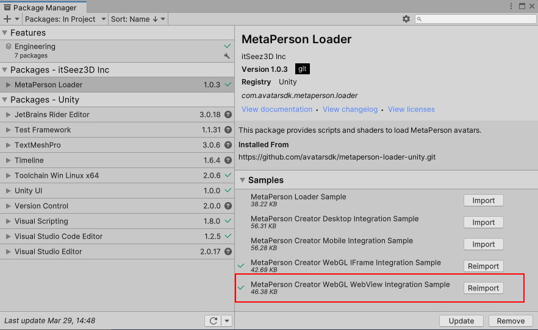
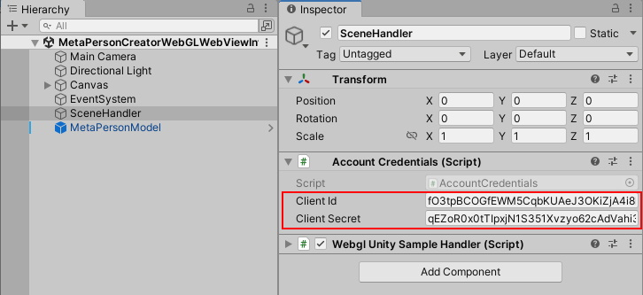
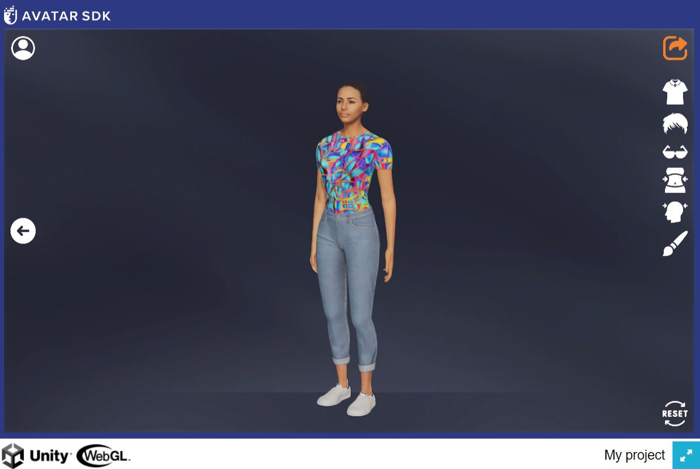
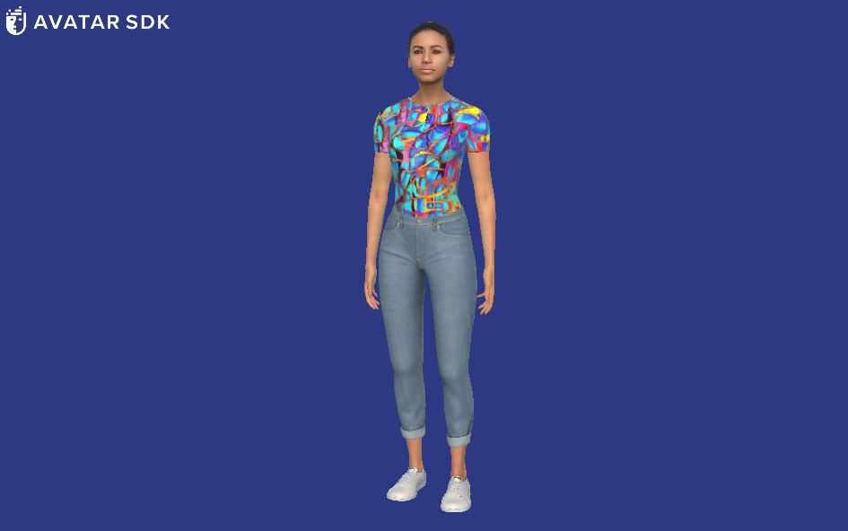

# MetaPerson Creator - Integration Into WebGL Application 
This sample demonstrates how to integrate the [MetaPerson Creator](https://metaperson.avatarsdk.com/) web page into **WebGL** applications via a **WebView** component and export an avatar from it.

**Note:** A special WebView component is required to display web pages inside a Unity application. This sample uses the [Vuplex Web View](https://store.vuplex.com/webview/webgl) plugin. We can provide you with a **20% discount** coupon for this plugin. Please contact us <support@avatarsdk.com> to get it.

## Reqirements
 * Unity 2021.3.19f1
 * Built-in render pipeline
 * Linear color space for better rendering quality
 * [Vuplex Web View](https://store.vuplex.com/webview/webgl) plugin

## Getting Started
**1\.** Open the sample scene. 

You can get this sample via Unity Package Manager or clone the repository and run the sample from it.

### Get the sample via Package Manager.

 * Open *Window->Package Manager*, click on the **+** icon in the top left corner and select **Add Package From Git URL**.
 


 * Provide the Git URL of this project:

`https://github.com/avatarsdk/metaperson-loader-unity.git`

 * Import **MetaPerson Creator WebGL WebView Integration Sample** as well.



 * Open the `Assets/Samples/MetaPerson Loader/0.1.1/MetaPerson Creator WebGL WebView Integration Sample/Scenes/MetaPersonCreatorWebGLWebViewIntegrationSample.unity` scene.


### Get the sample from the repository.

 * Clone this repository to your computer.

 * Open the project from `metaperson-loader-unity\Samples~\MetaPersonCreatorWebGLWebViewIntegrationSample` directory in Unity 2021.3.19f1 or a newer.

 * Open the `Assets\AvatarSDK\MetaPerson\WebGLWebViewIntegrationSample\Scenes\MetaPersonCreatorWebGLWebViewIntegrationSample.unity` scene.
 
 
**2\.** Import [Vuplex plugin](https://store.vuplex.com/webview/webgl) into the project.

**3\.** Find **SceneHandler** object and provide your [Account Credentials](#account-credentials).



**4\.** Switch to the **WebGL** platform in **Build Settings**.

**5\.** Add the `Assets/Samples/MetaPerson Loader/x.y.z/MetaPerson Creator WebGL WebView Integration Sample/Scenes/MetaPersonCreatorWebGLWebViewIntegrationSample.unity` scene into **Build Settings**

**6\.** Click the **Build and Run** button and specify the destination path for your WebGL build. When the building process if finished, the application will be opened in a browser.

**7\.** Press the **Get Avatar** button. MetaPerson Creator page will be shown.

**8\.** Select any of the sample avatars or create your own, customize it, and press the **Export** button.



**9\.** The avatar will be exported and added to the scene.



## Account Credentials
To export models from the [MetaPerson Creator](https://metaperson.avatarsdk.com/), you'll need AvatarSDK developer account credentials. Follow these steps to obtain them:

1. **Create an AvatarSDK Developer Account.**
   Visit the [AvatarSDK Developer Signup page](https://accounts.avatarsdk.com/developer/signup/) to create your AvatarSDK developer account. If you already have an account, you can skip this step.

2. **Create an Application.**
   After successfully registering or logging in to your AvatarSDK developer account, go to the [Developer Dashboard](https://accounts.avatarsdk.com/developer/). Here, create a new application. 

3. **Retrieve Your App Client ID and App Client Secret.**
   Once your application is created, you can obtain your **App Client ID** and **App Client Secret** from the Developer Dashboard.


Find out more information about business integration at https://docs.metaperson.avatarsdk.com/business_integration.html. 

## How It Works
To integrate the [MetaPerson Creator](https://metaperson.avatarsdk.com/iframe_vuplex.html) page into your Unity application, it should be shown in a WebView component. This sample uses the [Vuplex Web View](https://store.vuplex.com/webview/webgl) for this purpose. The iframe for WebGL platform is different from the [iframe](https://metaperson.avatarsdk.com/iframe.html) used on other platforms. This is due to the [limitations](https://support.vuplex.com/articles/webgl-limitations) of the WebGL version of vebview compared to the other 3D WebView packages. The WebGL version of iframe includes code that acts as a proxy and forwards messages from the Unity code to the original iframe and also handles callbacks.

The communication between [MetaPerson Creator](https://metaperson.avatarsdk.com/iframe_vuplex.html) and Unity is carried out through the use of the [JS API](https://docs.metaperson.avatarsdk.com/js_api.html).

Here's how it works:

1. Load the following page in a WebView component: `https://metaperson.avatarsdk.com/iframe_vuplex.html`.

2. Due to the CORS [limitations](https://support.vuplex.com/articles/webgl-limitations) we are not able to execute Javascript code for iframe in WebGL builds, so we use the **WebView.PostMessage** method to comunicate with the iframe. We also need to subscribe to the corresponding event to recieve messages from the iframe:

```cs
canvasWebViewPrefab.WebView.MessageEmitted += OnWebViewMessageReceived;
```

We prepare the messages of special format in the corresponding methods:

```cs
private string GetAuthenticateMessage()
{
    return string.Format("{{ \"eventName\" : \"authenticate\", \"clientId\" : \"{0}\", \"clientSecret\" : \"{1}\" }}"
       , credentials.clientId, credentials.clientSecret);
}
private string GetExportParametersMessage()
{
    string format = "glb";
    string lod = "1";
    string textureProfile = "1K.jpg";
    return string.Format("{{ \"eventName\" : \"set_export_parameters\", \"format\" : \"{0}\", \"lod\" : \"{1}\", \"textureProfile\" : \"{2}\" }}"
       , format, lod, textureProfile);
}
private string GetUiParametersMessage()
{
    string isExportButtonVisible = "true";
    string closeExportDialogWhenExportComlpeted = "true";
    return string.Format("{{ \"eventName\" : \"set_ui_parameters\", \"isExportButtonVisible\" : \"{0}\", \"closeExportDialogWhenExportComlpeted\" : \"{1}\" }}"
      , isExportButtonVisible, closeExportDialogWhenExportComlpeted);
}
```

**Authentication message** is responsible for providing your client credentials. **Export parameters message** sets up format of file of the resulting model, level of details and texture format and size. Some of Metaperson Creator's UI Parameters can be set with the help of the **UI parameters message**.

These messages are sent in response to the "unity_loaded" message that we receive from the iframe:

```cs
if (simpleEvent.eventName == "unity_loaded")
{
    string authMessage = GetAuthenticateMessage();
    Debug.Log("Auth: " + authMessage);
    canvasWebViewPrefab.WebView.PostMessage(authMessage);
    string exportParamsMessage = GetExportParametersMessage();
    Debug.Log("Export: " + exportParamsMessage);
    canvasWebViewPrefab.WebView.PostMessage(exportParamsMessage);
    string uiParamsMessage = GetUiParametersMessage();
    Debug.Log("Ui: " + uiParamsMessage);
    canvasWebViewPrefab.WebView.PostMessage(uiParamsMessage);
    return;
}
```

Implementation details can be found in the [MPCWebPageUsageSample.cs script](./../Samples~/MetaPersonCreatorWebGLWebViewIntegrationSample/Assets/AvatarSDK/MetaPerson/WebGLWebViewIntegrationSample/Scripts/WebglUnitySampleHandler.cs).

## JS API Parameters
The JS API allows you to configure various parameters related to authentication, export, and the user interface (UI) of the [MetaPerson Creator](https://metaperson.avatarsdk.com/iframe_vuplex.html).

### Authentication Parameters
To ensure your application is authorized to access the [MetaPerson Creator](https://metaperson.avatarsdk.com/iframe_vuplex.html), you need to specify your [developer credentials](#account-credentials). The following parameters are involved:
 - **eventName:** This should be set to `authenticate`. This parameter informs the [MetaPerson Creator](https://metaperson.avatarsdk.com/iframe_vuplex.html) of the type of request you are making.
 - **clientId:** This should be your **App Client ID** from your account.
 - **clientSecret:** This should be your **App Client Secret** from your account.

### Export Parameters
You can customize the output of the exported avatar by specifying parameters related to file format, resolution, and other options. These parameters include:
 - **eventName:** This should be set to `set_export_parameters` to inform the [MetaPerson Creator](https://metaperson.avatarsdk.com/iframe_vuplex.html) of the type of request you are making.
 - **format:** Specifies the mesh format of the exported avatar. Supported formats include **gltf**, **glb**, and **fbx**.
 - **lod:** Determines the level of detail (LOD) for the exported avatar mesh. The higher the value, the less detailed the mesh. Possible values are **1** and **2**.
 - **textureProfile:** Specifies the texture profile for the exported avatar, defining textures' resolution and format. Available options include **4K.png**, **2K.png**, **1K.png**, **4K.jpg**, **2K.jpg**, **1K.jpg**, **4K.webp**, **2K.webp**, and **1K.webp**.

### UI Parameters
You can also customize certain aspects of the [MetaPerson Creator](https://metaperson.avatarsdk.com/iframe_vuplex.html) user interface. These parameters include:
 - **eventName:** This should be set to `set_ui_parameters`. This parameter informs the [MetaPerson Creator](https://metaperson.avatarsdk.com/iframe_vuplex.html) of the type of request you are making.
 - **isExportButtonVisible:** This parameter specifies whether the **export** button is visible in the UI.
 - **closeExportDialogWhenExportCompleted:** This parameter determines whether the modal window with the export link is closed automatically after the export is completed.

More information about JS API can be found here: https://docs.metaperson.avatarsdk.com/js_api.html

## Support
If you have any questions or issues with the plugin, please contact us <support@avatarsdk.com>.
