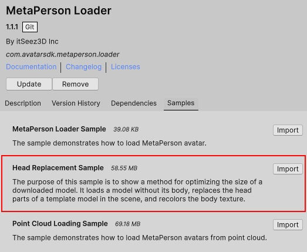
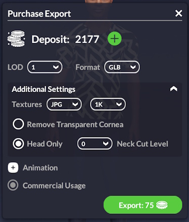

# MetaPerson - Head Replacement Sample

The purpose of this sample is to show a method for optimizing the size of a downloaded model. It loads a model without its body, replaces the head parts of a template model in the scene, and recolors the body texture.

## Getting Started
**1\.** Open the sample scene. 

You can get this sample via Unity Package Manager or clone the repository and run the sample from it.

### Get the sample via Package Manager.

 * Open *Window->Package Manager*, click on the **+** icon in the top left corner and select **Add Package From Git URL**.
 


 * Provide the Git URL of this project:

`https://github.com/avatarsdk/metaperson-loader-unity.git`

 * Import **Head Replacement Sample** .



 * Open the `Assets/Samples/MetaPerson Loader/<ver>/Head Replacement Sample/Scenes/HeadReplacementSample.unity` scene.

### Get the sample from the repository.

 * Clone this repository to your computer.

 * Open the project from the `metaperson-loader-unity\Samples~\MetaPersonLoaderHeadReplacementSample` directory in Unity 2021.3.19f1 or a newer.

 * Open the `Assets/AvatarSDK/MetaPerson/HeadReplacementSample/Scenes/HeadReplacementSample.unity` scene.

**2\.** Run the scene.

**3\.** Select the avatar's gender and LOD, press the **Load Avatar** button.

## How It Works

This sample uses a **template model** stored as a GLB file in the project assets. Each avatar gender and LOD has a corresponding template model.
 * The body mesh remains identical across avatars.
 * Variations include the head, eyelashes, eyeballs, cornea, teeth meshes vertex positions and color textures.
 
To minimize loaded data for each avatar, the following files are used:
 * A **GLB** file with the avatar's **head**, **eyes**, **eyelashes** and **teeth**.
 * A **model.json file** containing the avatar's skin color.

### Avatar Loading Workflow
The [MetaPersonInstantiator](./../Runtime/Scripts/MetaPersonInstantiator.cs) is used to load an avatar from a GLB file and replace the head of a template model:

```cs
MetaPersonInstantiator metaPersonInstantiator = new MetaPersonInstantiator();
GameObject avatarModel = await metaPersonInstantiator.LoadModelWithHeadReplacement(templateModelPrefab, headModelPath, modelJsonPath);
```

The `LoadModelWithHeadReplacement` method performs the following steps:
1. Instantiates the template model.
2. Loads the head model from the provided GLB file.
3. Replaces the template model’s vertex positions (head geometry) with the vertices from the loaded head model.
4. Replaces the template model’s color textures with textures from the loaded head model where appropriate.
5. Recolors the body texture to match the head.

### Exporting head-only GLB models

You can export head-only models in two ways:

1. Directly from the [MetaPerson Creator](https://metaperson.avatarsdk.com/).



2. Run **MetaPerson Creator** in [business integration](https://docs.metaperson.avatarsdk.com/business-integration/) mode and specify required export parameters via the [JS API](https://docs.metaperson.avatarsdk.com/js_api#export-parameters).

## Support
If you have any questions or issues with the plugin, please contact us <support@avatarsdk.com>.
