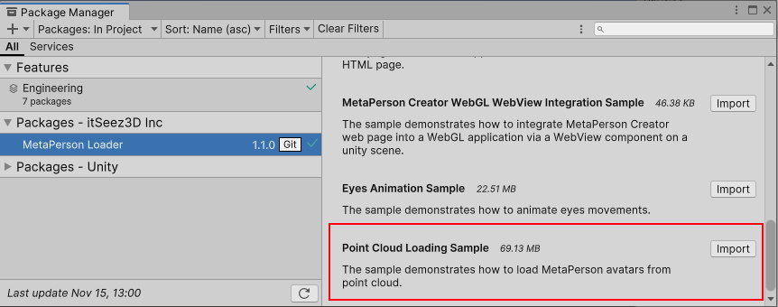

# MetaPerson - Point Cloud Loading Sample

This sample demonstrates how to load an avatar model from a point cloud for optimizing data size and memory usage. 
It is designed for users who generate avatars using the **MetaPerson Standalone Application**, allowing configuration of appropriate model output formats.

## Getting Started
**1\.** Open the sample scene. 

You can get this sample via Unity Package Manager or clone the repository and run the sample from it.

### Get the sample via Package Manager.

 * Open *Window->Package Manager*, click on the **+** icon in the top left corner and select **Add Package From Git URL**.
 


 * Provide the Git URL of this project:

`https://github.com/avatarsdk/metaperson-loader-unity.git`

 * Import **Point Cloud Loading Sample** .



 * Open the `Assets/Samples/MetaPerson Loader/<ver>/Point Cloud Loading Sample/Scenes/PointCloudLoadingSample.unity` scene.

### Get the sample from the repository.

 * Clone this repository to your computer.

 * Open the project from the `metaperson-loader-unity\Samples~\MetaPersonLoaderPointCloudSample` directory in Unity 2021.3.19f1 or a newer.

 * Open the `Assets/AvatarSDK/MetaPerson/PointCloudLoadingSample/Scenes/PointCloudLoadingSample.unity` scene.

**2\.** Run the scene.

**3\.** Select the avatar's gender and LOD, press the **Load Avatar** button.

## How It Works

This sample uses a **template model** stored as a GLB file in the project assets. Each avatar gender and LOD has a corresponding template model.
 * The body mesh remains identical across avatars.
 * Variations include the head, eyelashes, eyeballs, cornea, teeth meshes vertex positions and color textures.
 
To minimize loaded data for each avatar, the following files are used:
 * **PLY files** for the head, eyelashes, eyeballs, corneas, and teeth.
 * **Color textures** for the head and corneas.
 * A **model.json file** containing the avatar's skin color.

### Avatar Loading Workflow
The [MetaPersonInstantiator](./../Runtime/Scripts/MetaPersonInstantiator.cs) is used to load an avatar from a point cloud:

```cs
MetaPersonInstantiator metaPersonInstantiator = new MetaPersonInstantiator();
GameObject avatarModel = await metaPersonInstantiator.LoadModelFromPointCloud(template_model_prefab, "path_to_avatar_dir");
```

The `LoadModelFromPointCloud` method:
1. Instantiates the template model.
2. Loads vertex positions from point clouds and applies them to the meshes.
3. Loads and applies color textures.
4. Recolors the body texture.

**Note**: If inner meshes (e.g., teeth or eyeballs) are not visible in your application, consider using a template model without these components and omitting them from the avatar's directory. For example:
 * Use a simplified template if the avatar does not open its mouth.
 * Remove eyeballs if the sclera texture obscures them.

### Adding Template Models to Your Project

To use a custom template model (e.g., with different body shapes or without specific components):
1. Generate the model using the **Standalone Application**.
2. Import it into your project.
3. Create a prefab from the imported model.

**Export Configuration Example (GLB Template)**:
```json
{
  "format":"glb",
  "lod":"LOD1",
  "finalize": false,
  "export_template_models":true,
  "avatar":
  { 
    "list":
    [
      "AvatarBody",
      "AvatarHead",
      "AvatarEyelashes",
      "AvatarLeftCornea",
      "AvatarRightCornea",
      "AvatarLeftEyeball",
      "AvatarRightEyeball",
      "AvatarTeethLower",
      "AvatarTeethUpper"
    ]
  },
  "textures":
  {
    "profile":"1K.png",
    "embed" : false
  }
}
```

The key parameter is `"export_template_models": true`, which specifies that a template model should be exported.

### Generating Point Clouds

To generate a point cloud for an avatar, use the **Standalone Application** with the following configuration:

**Export Configuration Example (Point Cloud):**
```json
{
  "format":"ply",
  "lod":"LOD1",
  "finalize": true,
  "split_vertices":true,
  "avatar":
  { 
    "list":
    [
      "AvatarBody",
      "AvatarHead",
      "AvatarEyelashes",
      "AvatarLeftCornea",
      "AvatarRightCornea",
      "AvatarLeftEyeball",
      "AvatarRightEyeball",
      "AvatarTeethLower",
      "AvatarTeethUpper"
    ],
    "textures":
    {
      "list":
      [
        "Color"
      ]
    },
    "pointclouds": true
  },
  "textures":
  {
    "profile":"1K.png"
  },
  "haircuts":
  {
    "list":
    [
      "HaircutGenerated"
    ],
    "textures":
    {
      "list":
      [
        "Color"
      ]
    }
  },
  "blendshapes":
  {
    "list":
    [
      "mobile_51",
      "visemes_14"
    ]
  }
}
```

Important Parameters:

* `"split_vertices": true`
* `"pointclouds": true`

The output directory contains several files, but only highlighted in bold are required for Unity:
* AvatarBody.ply
* AvatarBodyMale_Color_1K.png
* **AvatarEyelashes.ply**
* AvatarEyes_Color_512.png
* **AvatarHead.ply**
* **AvatarHeadMale_Color_1K.png**
* **AvatarLeftCornea.ply**
* **AvatarLeftCornea_Color_512.png**
* **AvatarLeftEyeball.ply**
* **AvatarRightCornea.ply**
* **AvatarRightCornea_Color_512.png**
* **AvatarRightEyeball.ply**
* AvatarTeeth_Color_1K.png
* **AvatarTeethLower.ply**
* **AvatarTeethUpper.ply**
* **blendshapes** directory (you can delete unused blendshapes)

To enable body texture recoloring, copy the `model.json` file from the **intermediate_data** directory to the **output_export** directory.

### Adding Outfits

Outfits can be stored as GLB prefabs in the project. Add them to avatars using:

```cs
metaPersonInstantiator.AddOutfit(avatarModel, outfitPrefab);
```

**Export Configuration Example (Outfit):**

```json
{
  "format":"glb",
  "lod":"LOD1",
  "finalize": false,
  "export_template_models":true,
  "avatar":
  { 
    "list":
    [
      "AvatarBody",
      "AvatarHead",
      "AvatarEyelashes",
      "AvatarLeftCornea",
      "AvatarRightCornea",
      "AvatarLeftEyeball",
      "AvatarRightEyeball",
      "AvatarTeethLower",
      "AvatarTeethUpper"
    ]
  },
  "outfits":
  {
    "list":
    [
      "SEVAN"
    ],
    "embed":false,
    "textures":
    {
      "list":
      [
        "Color",
        "Normal",
        "UnityMetallicSmoothness",
        "BodyVisibilityMask",
        "HeadVisibilityMask"
      ]
    }
  },
  "textures":
  {
    "profile":"1K.jpg",
    "embed" : false
  }
}
```

## Support
If you have any questions or issues with the plugin, please contact us <support@avatarsdk.com>.
