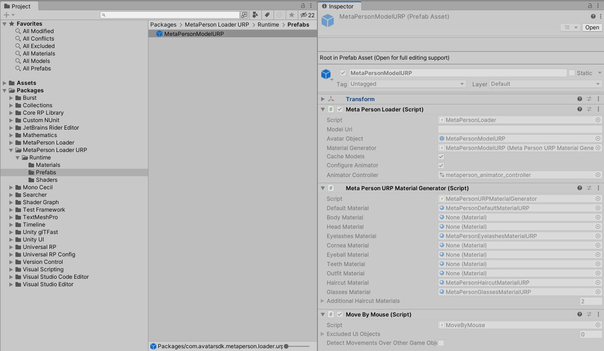
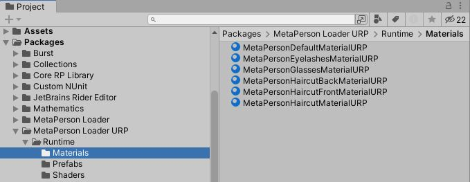
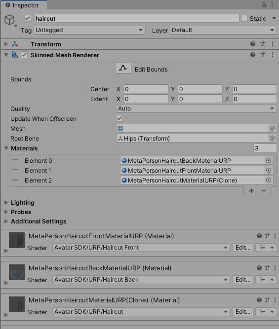

# MetaPerson Loader - URP Support

MetaPerson avatars can be seamlessly integrated into a URP project.

## Getting Started

1. Add the **MetaPerson Loader** package via Package Manager by Git URL:

`https://github.com/avatarsdk/metaperson-loader-unity.git`

2. Add the **MetaPerson Loader URP** package via Package Manager by Git URL. This package includes the necessary URP shaders and materials.

`https://github.com/avatarsdk/metaperson-loader-unity.git`

3. Import **MetaPerson Loader URP Sample**.

3. Run the `Assets/Samples/MetaPerson Loader URP/[ver]/MetaPerson Loader URP Sample/Scenes/MetaPersonLoaderURPSample.unity` scene.

## How It Works

To use MetaPerson avatars in your scene, follow these steps:

1. **Add the MetaPersonModelURP Prefab:**
   - Add the **MetaPersonModelURP** prefab to your scene.

2. **Configure the Meta Person Loader Component:**
   - In the **Meta Person Loader** component, specify the URL of your avatar model in GLB format.

3. **Setup the Meta Person URP Material Generator:**
   - The **Meta Person URP Material Generator** component lets you define template materials. It generates the avatar's materials based on these templates, configures textures, and sets up mesh renderers. You can customize this by using your own template materials and extending the **Material Generator** to override specific methods.

### Template Materials

Temaple materials are located in the `Packages/com.avatarsdk.metaperson.loader.urp/Runtime/Materials` directory.

Most materials use the `URP\Lit` shader, except for the haircut materials, which use specialized shaders.

### Haircut Shaders

Haircuts require three specific materials, each utilizing an unique shader. The order of these materials is crucial:

* `Avatar SDK/URP/Haircut Back`
* `Avatar SDK/URP/Haircut Front`
* `Avatar SDK/URP/Haircut`

## Support
If you have any questions or issues with the plugin, please contact us <support@avatarsdk.com>.
