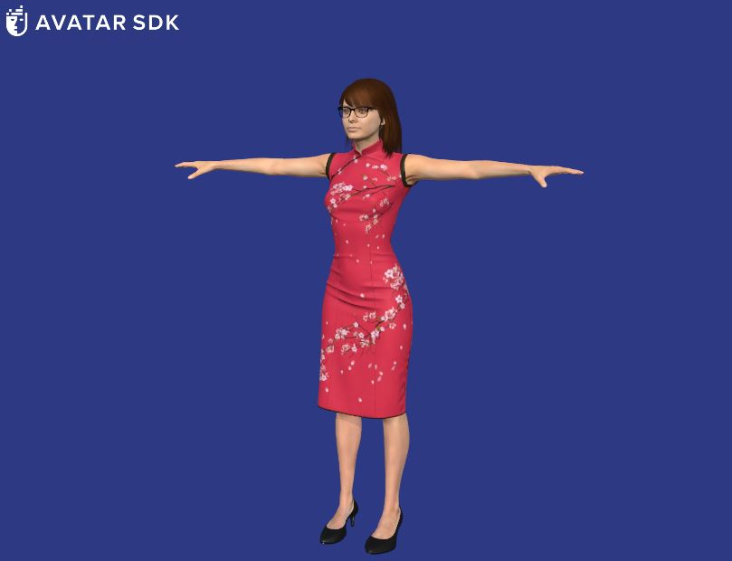
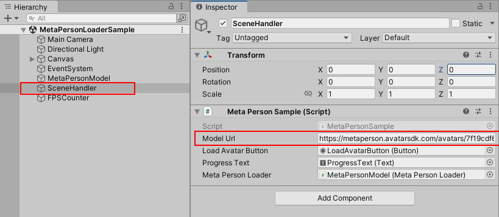

# MetaPerson Loader Unity Sample
Sample shows how to load MetaPerson models in Unity

## Requirements
 * Unity 2021.3.19f1 or above
 * Built-in render pipeline
 * Supported platforms: Windows, MacOS, Android, iOS, WebGL
 
## Getting Started
* Clone this repository to your computer
* Open the project in Unity 2021.3.19f1 or above.
* Open an `Assets/AvatarSDK/MetaPerson/Sample/Scenes/MetaPersonLoaderSample.unity` scene.
* Run the scene and press the "Load Avatar" button.
* Avatar will be downloaded and addded to the scene.

To load another model, you need to provide a URL to the GLB/GLTF model or to a ZIP archive that contains such a model. Update the **Model Url** field in the **Meta Person Sample** script.

## How It Works

## Support
If you have any questions or issues with the plugin, please contact us <support@avatarsdk.com>.