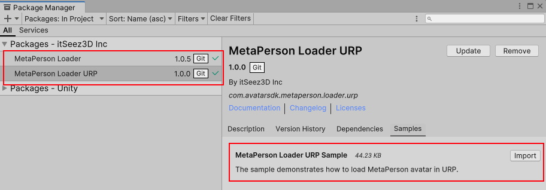

# MetaPerson Loader For Unity
The package enables loading MetaPerson avatars in Unity in GLB/GLTF format.

## Requirements
 * Unity 2021.3.19f1 or a more recent version
 * Built-in render pipeline
 * Linear color space for better rendering quality
 * Supported platforms: Windows, MacOS, Android, iOS, WebGL
 
## Getting Started
You have two options to get started: you can import this package and the sample via Unity Package Manager or clone the repository and run the sample from it.

### Import Via Package Manager
1\. Open *Window->Package Manager*, click the **+** icon in the top left corner, and select **Add Package From Git URL**.


2\. Provide the Git URL of this project:

`https://github.com/avatarsdk/metaperson-loader-unity.git`

3\. Import **MetaPerson Loader Sample** as well.


4\. Open the `Assets/Samples/MetaPerson Loader/[ver]/MetaPerson Loader Sample/Scenes/MetaPersonLoaderSample.unity` scene.

5\. Run the scene and click the "Load Avatar" button.

6\. The avatar will be downloaded and added to the scene.


### Copy Repository And Run Sample Project
1\. Clone this repository to your computer.

2\. Open the project from the `metaperson-loader-unity\Samples~\MetaPersonLoaderSample` directory in Unity 2021.3.19f1 or a newer.

3\. Open the `Assets/AvatarSDK/MetaPersonLoader/Sample/Scenes/MetaPersonLoaderSample.unity` scene.

4\. Run the scene and click the "Load Avatar" button.

5\. The avatar will be downloaded and added to the scene.

#### Changing The Loaded Model
To load another model, provide a URL to the GLB/GLTF model or a ZIP archive containing such a model. Update the **Model Url** field in the **Meta Person Sample** script.


## How It Works
This package uses [glTFast](https://docs.unity3d.com/Packages/com.unity.cloud.gltfast@6.0/manual/index.html) to load MetaPerson models in **GLB/GLTF** format.

To load a MetaPerson model, follow these steps:
1. Create an empty object in the scene.
2. Add a [MetaPersonLoader](./Runtime/Scripts/MetaPersonLoader.cs) component to this object.
3. Specify the **Avatar Object** field, which is the parent object of the instantiated avatar.
4. It's recommended to create a [MetaPersonMaterialGenerator](./Runtime/Scripts/MetaPersonMaterialGenerator.cs) component and assign it to the **Material Generator** field of the [MetaPersonLoader](./Runtime/Scripts/MetaPersonLoader.cs).
This component provides preconfigured materials and sets up avatar textures. When **Material Generator** isn't specified, default materials are used.
.
5. Call the **LoadModelAsync** method of the [MetaPersonLoader](./Runtime/Scripts/MetaPersonLoader.cs) by passing a URL to a model.
```c#
bool isModelLoaded = await metaPersonLoader.LoadModelAsync(modelUrl, p => Debug.LogFormat("Downloading avatar: {0}%", (int)(p * 100)));
```

### MetaPersonLoader Properties
 * **Model Url**: a URL to the GLB/GLTF or a ZIP with a MetaPerson model.
 * **Avatar Object**: a parent object of the instantiated avatar. If it isn't specified, the MetaPersonLoader's object is a parent of the avatar.
 * **Material Generator**: provides avatar's materials.
 * **Cache Models**: if true, the downloaded model is saved to the [persistent storage](https://docs.unity3d.com/ScriptReference/Application-persistentDataPath.html) for caching.
 * **Configure Animator**: if true, an Animator component is added to the avatar.
 * **Animator Controller**: runtime animator contoller assigned to the Animator.

### MetaPersonMaterialGenerator
The [MetaPersonMaterialGenerator](./Runtime/Scripts/MetaPersonMaterialGenerator.cs) component offers preconfigured materials to be used in place of the default materials provided by [glTFast](https://docs.unity3d.com/Packages/com.unity.cloud.gltfast@6.0/manual/index.html). It also ensures that textures are set up correctly.

This component includes the following materials:
 * **Default Material**: This material is used by default.
 * **Body Material**: This material is used to render the avatar's body.
 * **Head Material**: This material is used to render the avatar's head.
 * **Eyelashes Material**: This material is used to render eyelashes.
 * **Cornea Material**: This material is used to render cornea.
 * **Eyeball Material**: This material is used to render eyeballs.
 * **Outfit Material**: This material is used to render outfits.
 * **Haircut Material**: This material is used to render haircuts.
 * **Glasses Material**: This material is used to render glasses.
 
This component lets you specify the template materials to meet your specific requirements. You may also implement a custom version of the **MaterialGenerator**.

## How to Obtain a Model in GLB Format
By default, [MetaPerson Creator](https://metaperson.avatarsdk.com/) exports models in **FBX** format. If you want to export a model in **GLB** format, follow these steps:

1. Run **MetaPerson Creator** in [business integration](https://docs.metaperson.avatarsdk.com/business-integration/) mode.
2. Specify **GLB** format in export parameters using the [JS API](https://docs.metaperson.avatarsdk.com/js_api#export-parameters).
3. Create and export the model. 
4. Once **MetaPerson Creator** exports the model in **GLB** format, it will provide a link to the model. You can copy and store this link and use it to load the model into your application. Note that this link does not expire.

For a demonstration, check out our [web integration sample](https://metaperson.avatarsdk.com/business.html), which exports MetaPerson models in **GLB**. 
To run this sample, you'll need credentials from your [avatar sdk developer account](https://docs.metaperson.avatarsdk.com/getting_started).

## URP Support
To integrate MetaPerson avatars into a URP (Universal Render Pipeline) project, follow these steps:

1. Add an additional **MetaPerson Loader URP** package via Package Manager by Git URL:

`https://github.com/avatarsdk/metaperson-loader-unity.git?path=/URP~`

2. Import **MetaPerson Loader URP Sample**.



3. Run the `Assets/Samples/MetaPerson Loader URP/[ver]/MetaPerson Loader URP Sample/Scenes/MetaPersonLoaderURPSample.unity` scene.

For more details on implementation, refer to the [URP Support documentation](./Documentation~/URPSupport.md).

## How to Animate Eyes Movements
To animate eye movements (look up, down, left, right), follow these steps:

1. Attach the `EyesAnimator` component to the avatar object.

2. Use the methods of the `EyesAnimator` component to set the eye movement weights. The weight parameter should be a float value in the range [0, 1].

```cs
EyesAnimator eyesAnimator = ...; // Obtain a reference to the EyesAnimator component

// Set the weights for eye movements
eyesAnimator.SetLookUpWeight(weight);    // Look up
eyesAnimator.SetLookDownWeight(weight);  // Look down
eyesAnimator.SetLookLeftWeight(weight);  // Look left
eyesAnimator.SetLookRightWeight(weight); // Look right
```

Here's a quick example to illustrate how you might use these methods in a script:

```cs
// Assume you have a reference to the EyesAnimator component
EyesAnimator eyesAnimator = avatar.GetComponent<EyesAnimator>();

// Example: Make the eyes look up with half intensity
eyesAnimator.SetLookUpWeight(0.5f);
```

For more details, refer to the [Eyes Animation Sample](./Documentation~/MetaPersonCreatorEyesAnimationSample.md).
 
## How To Integrate MetaPerson Creator Into Your Application
[MetaPerson Creator](https://metaperson.avatarsdk.com/)  web page can be integrated into your application, allowing your clients to create their custom avatars and import them into your product.

Unity samples:
 * [Windows and macOS](./Documentation~/MetaPersonCreatorDesktopIntegration.md)
 * [Android and iOS](./Documentation~/MetaPersonCreatorMobileIntegration.md)
 * [Android and iOS via Vuplex webview](./Documentation~/MetaPersonCreatorMobileIntegrationViaVuplex.md)
 * [VR Quest](https://github.com/avatarsdk/metaperson-vr-quest-sample)
 * [WebGL - integration via IFrame](./Documentation~/MetaPersonCreatorWebGLIFrameIntegration.md)
 * [WebGL - integration via WebView](./Documentation~/MetaPersonCreatorWebGLWebViewIntegration.md)
 
Native samples:
 * [Android](https://github.com/avatarsdk/metaperson-android-sample)
 * [iOS](https://github.com/avatarsdk/metaperson-ios-sample)

Other samples:
 * [Integration with body tracking from the Movement SDK for Meta Quest](https://github.com/avatarsdk/metaperson-quest-movement-sdk-sample)
 * [Unity Multiplayer Photon Sample](https://github.com/avatarsdk/metaperson-unity-photon-sample)

## Support
If you have any questions or issues with the plugin, don't hesitate to contact us at <support@avatarsdk.com>.
