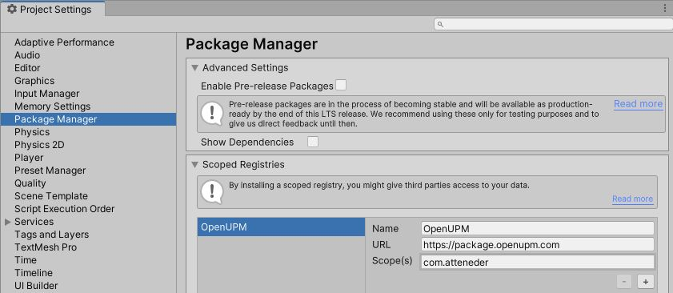
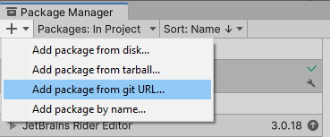
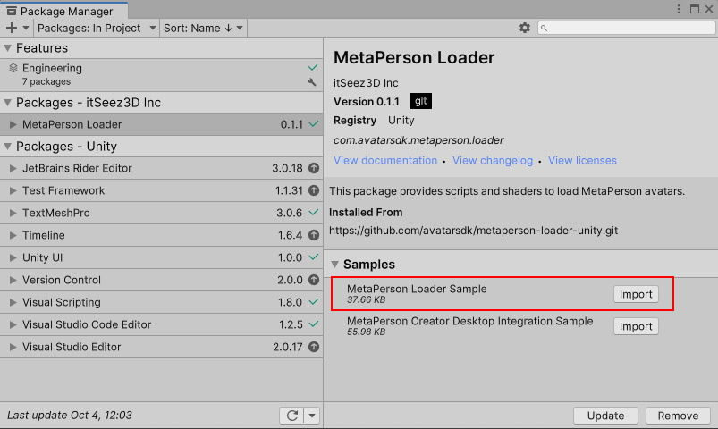
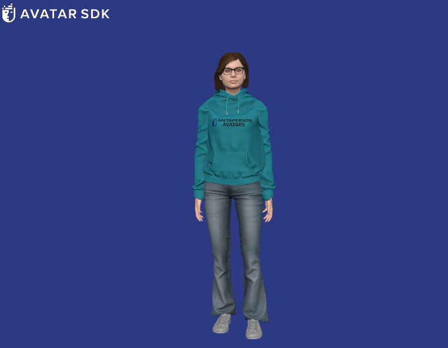
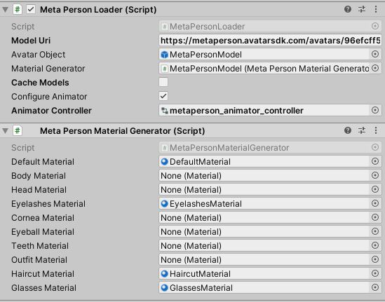

# MetaPerson Loader For Unity
The package helps to load MetaPerson avatars in GLB/GLTF format in Unity.

## Requirements
 * Unity 2021.3.19f1 or a more recent version
 * Built-in render pipeline
 * Supported platforms: Windows, MacOS, Android, iOS, WebGL
 
## Getting Started
You have two options to get started: you can import this package and the sample via Unity Package Manager or clone the repository and run the sample from it.

### Import Via Package Manager
1\. To import the [glTFast](https://github.com/atteneder/glTFast) package as a dependency of **MetaPerson Loader**, add a new Scoped Registry to *Project Settings -> Package Manager*:

```json
"scopedRegistries": [
  {
    "name": "OpenUPM",
    "url": "https://package.openupm.com",
    "scopes": [
      "com.atteneder"
    ]
  }
]
```


2\. Open *Window->Package Manager*, click on the **+** icon in the top left corner, and select **Add Package From Git URL**.



3\. Provide the Git URL of this project:

`https://github.com/avatarsdk/metaperson-loader-unity.git`

4\. Import **MetaPerson Loader Sample** as well.



5\. Open the `Assets/Samples/MetaPerson Loader/0.1.1/MetaPerson Loader Sample/Scenes/MetaPersonLoaderSample.unity` scene.

6\. Run the scene and click the "Load Avatar" button.

7\. The avatar will be downloaded and added to the scene.



### Copy Repository And Run Sample Project
1\. Clone this repository to your computer.

2\. Open the project from the `metaperson-loader-unity\Samples~\MetaPersonLoaderSample` directory in Unity 2021.3.19f1 or a newer.

3\. Open the `Assets/AvatarSDK/MetaPersonLoader/Sample/Scenes/MetaPersonLoaderSample.unity` scene.

4\. Run the scene and click the "Load Avatar" button.

5\. The avatar will be downloaded and added to the scene.

#### Changing The Loaded Model
To load another model, provide a URL to the GLB/GLTF model or a ZIP archive containing such a model. Update the **Model Url** field in the **Meta Person Sample** script.


## How It Works
This package uses [glTFast](https://github.com/atteneder/glTFast) to load MetaPerson models in **GLB/GLTF** format.

To load a MetaPerson model, follow these steps:
1. Create an empty object in the scene.
2. Add a [MetaPersonLoader](./Runtime/Scripts/MetaPersonLoader.cs) component to this object.
3. Specify the **Avatar Object** field, which is the parent object of the instantiated avatar.
4. It's recommended to create a [MetaPersonMaterialGenerator](./Runtime/Scripts/MetaPersonMaterialGenerator.cs) component and assign it to the **Material Generator** field of the [MetaPersonLoader](./Runtime/Scripts/MetaPersonLoader.cs).
This component provides preconfigured materials and sets up avatar textures. When **Material Generator** isn't provided, default materials are used.
.
5. Call the **LoadModelAsync** method of the [MetaPersonLoader](./Runtime/Scripts/MetaPersonLoader.cs) by passing a URL to a model.
```c#
bool isModelLoaded = await metaPersonLoader.LoadModelAsync(modelUrl, p => Debug.LogFormat("Downloading avatar: {0}%", (int)(p * 100)));
```

### MetaPersonMaterialGenerator
The [MetaPersonMaterialGenerator](./Runtime/Scripts/MetaPersonMaterialGenerator.cs) component offers preconfigured materials to be used in place of the default materials provided by [glTFast](https://github.com/atteneder/glTFast). It also ensures that textures are set up correctly.

This component includes the following materials:
 * **Default Material**: This material is utilized for rendering Head, Body, Eyes, Mouth, and Outfits meshes. It is based on the **Standard** opaque shader.
 * **Eyelashes Material**: This material is utilized for rendering Eyelashes meshes. It is based on the **Standard** fade shader.
 * **Haircut Material**: This material is utilized for rendering Haircuts meshes. The shader for this material can be found [here](./Runtime/Shaders/haircuts/avatar_sdk_haircut_standard.shader).
 * **Glasses Material**: This material is utilized for rendering Glasses meshes. It is based on the [double-sided **Standard** fade shader](./Runtime/Shaders/avatar_sdk_standard_double_sided.shader).
You have the flexibility to modify these template materials to suit your specific needs, or you can implement a custom version of the **MaterialGenerator**.

### Humanoid Animations
[HumanoidAnimatorBuilder](./Runtime/Scripts/Utils/HumanoidAnimatorBuilder.cs) class helps to configue the MetaPerson avatar as a Humanoid character.
1. Use **MakeAvatarHumanoid** method to assign an **Animator** component to the MetaPerson avatar and configure it as Humanoid. The **Animator** will be added to the **AvatarRoot** node.
```c#
HumanoidAnimatorBuilder humanoidAnimatorBuilder = new HumanoidAnimatorBuilder();
humanoidAnimatorBuilder.MakeAvatarHumanoid(avatarObject);
```
2. Assign **RuntimeAnimatorController**.
```c#
humanoidAnimatorBuilder.SetAnimatorController(animatorController, avatarObject);
```

## How To Integrate MetaPerson Creator Into Your Application
[MetaPerson Creator](https://metaperson.avatarsdk.com/)  web page can be integrated into your application, giving your clients the ability to create their custom avatars and import them into your product.

Unity samples:
 * [Windows and macOS](./Documentation~/MetaPersonCreatorDesktopIntegration.md)
 * [VR Quest](https://github.com/avatarsdk/metaperson-vr-quest-sample)
 * [WebGL](./Documentation~/MetaPersonCreatorWebGLIntegration.md)
 
Native samples:
 * [Android](https://github.com/avatarsdk/metaperson-android-sample)
 * [iOS](https://github.com/avatarsdk/metaperson-ios-sample)

Other samples:
 * [Integration with body tracking from the Movement SDK for Meta Quest](https://github.com/avatarsdk/metaperson-quest-movement-sdk-sample)

## Support
If you have any questions or issues with the plugin, please contact us <support@avatarsdk.com>.
